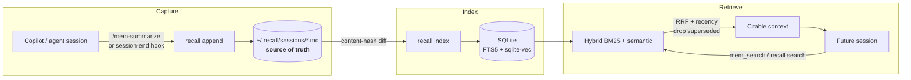

<h1 align="center">🧠 Recall</h1>

<p align="center">
  <b>A fully-local, self-evolving personal knowledge base for any agentic CLI.</b><br/>
  Capture the decisions, tradeoffs, gotchas, and open threads from every session.<br/>
  Retrieve them in future sessions via local hybrid RAG (BM25 + Ollama), exposed over MCP.
</p>

<p align="center">
  <a href="https://imshashwataggarwal.github.io/recall/"></a>
  <a href="#install"></a>
  
  
  <a href="LICENSE"></a>
  
</p>

<p align="center">
  🌐 <b><a href="https://imshashwataggarwal.github.io/recall/">imshashwataggarwal.github.io/recall</a></b> — one-click download
</p>

---

## What is Recall?

When you work with a coding agent, hard-won context evaporates the moment the
session ends: *why* you chose JWT over sessions, the gotcha that cost an hour, the
thread you meant to pick up next time. **Recall** is the memory layer that fixes
this. It:

1. **Captures** structured knowledge from each session into human-readable
   Markdown — one append-only file per *workstream*.
2. **Indexes** it locally into SQLite (FTS5 keyword + `sqlite-vec` semantic).
3. **Retrieves** the right context in future sessions through a hybrid search,
   surfaced to your agent over **MCP**.

It works for **any workstream** — code repos *and* non-code work (research,
writing, ops) — and it **runs entirely on your machine**: no cloud, no API keys,
no telemetry.

> **Markdown is the source of truth.** The SQLite index is derived and rebuildable,
> so your memory is always something you can read, grep, edit, and version with git.

## Why it's different

- 🔒 **Local-first & private** — embeddings via your own Ollama; nothing leaves your box.
- 📝 **Durable & trustworthy** — memory is plain Markdown you own, not a binary blob.
- 🔁 **Self-evolving** — new decisions *supersede* old ones; consolidation distills
  durable summaries so the KB gets *better*, not just bigger.
- 🌐 **Universal** — any agentic CLI via MCP or the CLI; any workstream, code or not.
- 🛟 **Resilient** — degrades gracefully: no `sqlite-vec` → BM25-only; Ollama down →
  keyword search still works. It never hard-fails.

## How it works



Retrieval fuses two retrievers with **Reciprocal Rank Fusion**, blends in a
**recency** weight, and filters out **superseded** entries. See
[docs/architecture.md](docs/architecture.md) and [docs/design.md](docs/design.md)
for the full picture.

## Install

**One command** (from a clone):

```bash
# macOS / Linux
./scripts/install.sh
```
```powershell
# Windows (PowerShell)
./scripts/install.ps1
```

This finds Python, creates an isolated environment (pipx or `.venv`), installs
Recall with the MCP extra, runs `recall init`, and prints a `recall doctor` report.

<details>
<summary>Manual install</summary>

```bash
python3 -m venv .venv && source .venv/bin/activate   # Windows: .venv\Scripts\Activate.ps1
pip install -e ".[mcp]"        # add ,dev for tests
recall init
ollama pull embeddinggemma     # optional — enables semantic search
recall doctor
```
</details>

Semantic search needs [Ollama](https://ollama.com) + an embedding model; keyword
search works without it. Full guide: [docs/installation.md](docs/installation.md).

## Quick start

```bash
# Write a decision (body via stdin)
recall append --title auth-refactor --session 97f80d49 --tags auth,jwt --body - <<'EOF'
### Decision   Moved server sessions → stateless JWT.
### Why        Horizontal scaling; sessions were node-pinned.
### Tradeoffs  No instant revoke; added 5-min TTL + denylist.
### Open       Refresh-token rotation still TODO.
EOF

# Later — recall it (even with different words than you wrote)
recall search "how did we handle token revocation?"
recall search "rate limiting pattern" --all          # across all workstreams
recall recent -n 10                                  # where did we leave off?
recall consolidate                                   # distill durable summaries
recall doctor                                         # diagnose setup
```

Non-code work: pass `--workstream`, e.g.
`recall search "eval metric" --workstream research/rag-eval`. Inside a git repo the
workstream is auto-detected as `owner/repo`.

Full command reference: [docs/cli-reference.md](docs/cli-reference.md).

## Use it with your agent (MCP)

Register the server in your MCP config (e.g. `~/.copilot/mcp-config.json`):

```json
{ "mcpServers": { "recall": { "command": "recall-mcp" } } }
```

Then your agent gets five tools: `mem_search`, `mem_recent`, `mem_append`,
`mem_workstreams`, `mem_index`. Add the
[copilot-instructions snippet](integrations/copilot-instructions.snippet.md) so it
knows *when* to read and write, install the
[`/mem-summarize` skill](integrations/skills/mem-summarize/SKILL.md), and wire the
[session-end hook](integrations/hooks/session_end.py) for automatic capture. Details:
[docs/mcp-and-copilot.md](docs/mcp-and-copilot.md) ·
agent-agnostic guide: [AGENTS.md](AGENTS.md).

## Knowledge base layout

```
~/.recall/
├── config.toml               # ollama host, embed model/dim, search tuning
├── sessions/                 # *.md source of truth (+ *.summary.md, _index.md)
├── index/recall.db           # FTS5 + sqlite-vec (rebuildable: recall index --full)
└── logs/
```

Your memory (`~/.recall/sessions/`) is separate from the tool. To carry it across
machines, `git init` that folder or sync it — the index never needs syncing.

## Repository layout

```
recall/
├── .github/            # CI workflow + copilot-instructions for this repo
├── docs/               # architecture, design, call-flows, install, config, CLI, MCP
├── src/recall/         # the Python package
├── tests/              # pytest suite (offline; uses a FakeEmbedder)
├── integrations/       # Copilot wiring: session-end hook, /mem-summarize skill, snippet
├── scripts/            # one-command installers (install.sh / install.ps1)
├── AGENTS.md           # guide for any agentic CLI working in this repo
├── pyproject.toml      # packaging; entry points: recall, recall-mcp
└── LICENSE             # MIT
```

## Documentation

| Doc | What's inside |
|-----|---------------|
| [docs/architecture.md](docs/architecture.md) | Components, storage, module map, diagrams |
| [docs/design.md](docs/design.md) | Decisions, data model, the evolving loop, trade-offs |
| [docs/call-flows.md](docs/call-flows.md) | Sequence diagrams for every operation |
| [docs/installation.md](docs/installation.md) | Cross-platform install + troubleshooting |
| [docs/configuration.md](docs/configuration.md) | `config.toml` reference & tuning |
| [docs/cli-reference.md](docs/cli-reference.md) | Every command and flag |
| [docs/mcp-and-copilot.md](docs/mcp-and-copilot.md) | MCP server, skill, hook wiring |

## Development

```bash
pip install -e ".[mcp,dev]"
pytest          # expect: 16 passed (no Ollama/network needed)
```

Contributions welcome — see [CONTRIBUTING.md](CONTRIBUTING.md).

## License

[MIT](LICENSE) © Recall contributors
