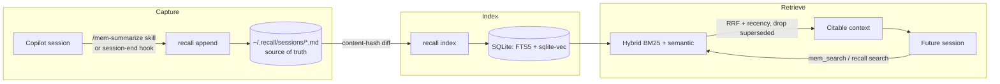

# Recall documentation

Recall is a fully-local, self-evolving personal knowledge base for Copilot and
any agentic CLI. This folder is the long-form documentation; the top-level
[`README.md`](../README.md) is the quick start.

## Contents

| Doc | What's inside |
|-----|---------------|
| [architecture.md](architecture.md) | System overview, components, storage layout, module map, component diagram |
| [design.md](design.md) | Design decisions and rationale, data model, the "evolving loop", trade-offs |
| [call-flows.md](call-flows.md) | Sequence diagrams for capture, index, search, consolidate, MCP and the session-end hook |
| [installation.md](installation.md) | Install on macOS / Linux / Windows, one-line installers, Ollama setup, troubleshooting |
| [configuration.md](configuration.md) | `config.toml` reference, environment variables, tuning retrieval |
| [cli-reference.md](cli-reference.md) | Every `recall` subcommand with flags and examples |
| [mcp-and-copilot.md](mcp-and-copilot.md) | Registering the MCP server, the skill, the hook, and copilot-instructions wiring |

## The 30-second mental model

Markdown is the source of truth; the SQLite index is derived and rebuildable.
Everything runs on your machine — no cloud, no API keys.
