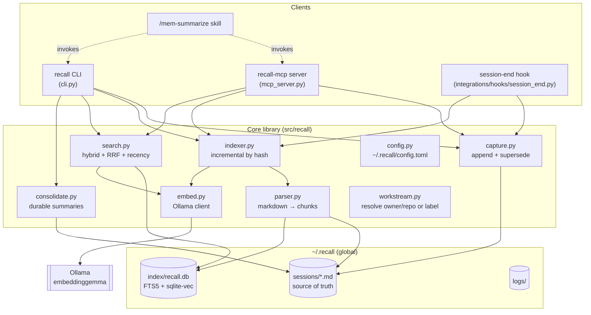
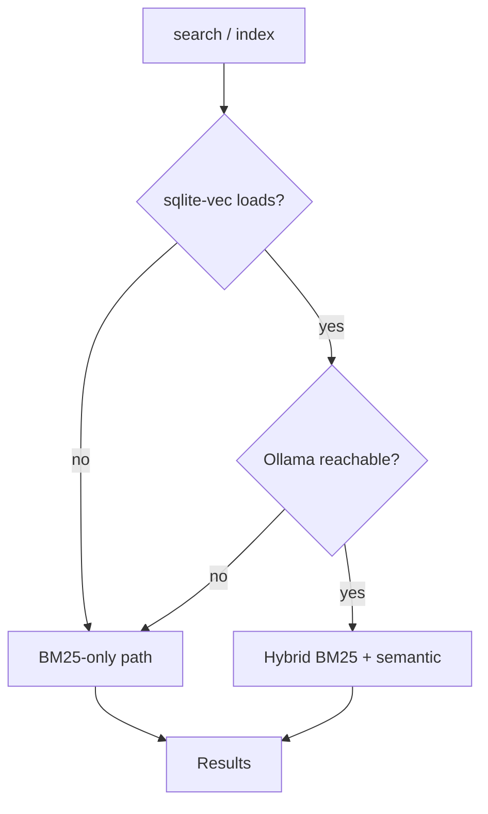
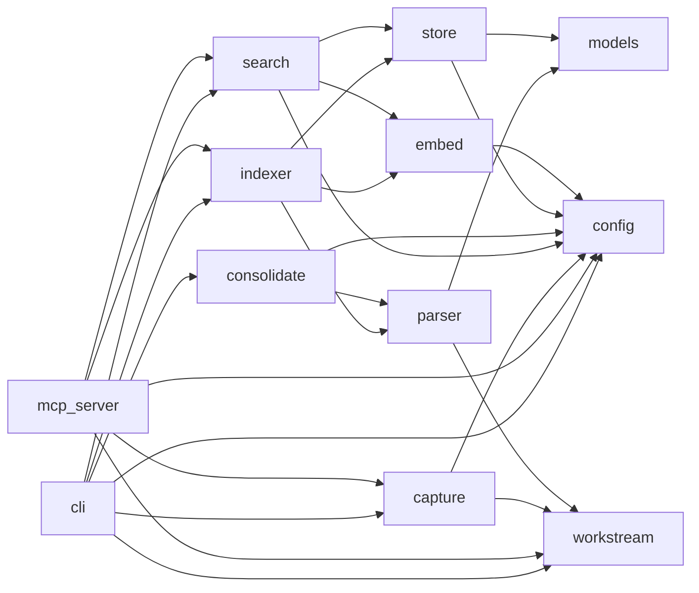

# Architecture

Recall is a small, layered Python application with one hard rule: **Markdown
files are the source of truth, and everything else is a rebuildable derivative.**

## 1. System overview



## 2. Layered responsibilities

| Layer | Modules | Responsibility |
|-------|---------|----------------|
| **Interface** | `cli.py`, `mcp_server.py`, `integrations/hooks/`, `integrations/skills/` | Turn user/agent intent into core calls. No business logic of their own. |
| **Capture** | `capture.py`, `workstream.py` | Append atomic, timestamped entries to the right workstream file; flip superseded entries. |
| **Parse** | `parser.py`, `models.py` | Read workstream Markdown back into typed `Entry` / `Chunk` objects. |
| **Index** | `indexer.py`, `store.py`, `embed.py` | Chunk → (optional embed) → SQLite; incremental by content hash. |
| **Retrieve** | `search.py` | Hybrid BM25 + semantic, Reciprocal Rank Fusion, recency weighting, status filtering. |
| **Evolve** | `consolidate.py` | Distill active entries into durable per-workstream summaries + a catalog. |
| **Config** | `config.py` | Resolve `~/.recall` (overridable via `RECALL_HOME`), load `config.toml` with defaults. |

## 3. Storage layout

Everything lives under a single global directory, `~/.recall/` (override with the
`RECALL_HOME` environment variable — this is how the test-suite isolates state):

```
~/.recall/
├── config.toml                 # ollama host, embed model/dim, search tuning
├── sessions/                   # SOURCE OF TRUTH (human-readable, diffable)
│   ├── acme__api-gateway.md    # one append-only file per workstream
│   ├── acme__api-gateway.summary.md   # generated durable summary (consolidate)
│   └── _index.md               # generated catalog of all workstreams
├── index/
│   └── recall.db               # derived, rebuildable: FTS5 + sqlite-vec + metadata
└── logs/
    └── hook.log                # session-end hook diagnostics (fail-safe)
```

### Why split source-of-truth from index?
- **Portability & trust:** your memory is plain Markdown you can read, grep, edit,
  and version with git — not locked in a binary store.
- **Rebuildability:** `recall index --full` reconstructs `recall.db` from the
  Markdown at any time, so the DB never needs to be synced or backed up.
- **Diffability:** `git init` inside `~/.recall/sessions/` gives you a full,
  reviewable history of how your knowledge evolved.

## 4. On-disk Markdown format

Each workstream file is append-only. A header identifies the workstream; each
entry is a heading plus an HTML-comment metadata line plus a structured body:

```markdown
# Workstream: acme/api-gateway
<!-- recall:workstream=acme/api-gateway type=repo -->

## 2026-06-14 · session 97f80d49 · auth-refactor
<!-- recall:entry id=97f80d49-1 ts=2026-06-14T15:04 session=97f80d49 tags=[auth,jwt] status=active supersedes=[] -->
### Decision   Moved server sessions → stateless JWT.
### Why        Horizontal scaling; sessions were node-pinned.
### Tradeoffs  No instant revoke; added 5-min TTL + denylist.
```

The metadata comment is machine-parsed (`parser.py`); the prose is what gets
embedded and shown back to you. `status=active|superseded` drives retrieval
filtering; `supersedes=[...]` records which earlier entries a decision retires.

## 5. The SQLite index schema

`store.py` owns three tables (plus FTS5/vec virtual tables):

| Object | Kind | Purpose |
|--------|------|---------|
| `files(slug, hash)` | table | Per-workstream content hash → enables incremental indexing. |
| `chunks(...)` | table | One row per entry: metadata + the context-prefixed text. |
| `fts_chunks` | FTS5 virtual | BM25 keyword index over `chunks.text` (external-content). |
| `vec_chunks` | vec0 virtual | `sqlite-vec` embeddings, one per chunk (created only if `sqlite-vec` loads). |

## 6. Graceful degradation (a first-class design goal)

Recall is built to **never hard-fail** on a missing optional dependency:



- No `sqlite-vec` → the `vec_chunks` table is never created; search uses BM25 only.
- Ollama down / model missing → embedding calls are caught and the run falls back
  to BM25 indexing/search (a one-line note is printed, nothing crashes).

This is verified by the test-suite (which runs entirely BM25-only via a
`FakeEmbedder`) and by `recall doctor`.

## 7. Module dependency graph



No cycles: interface modules depend on core; core modules depend on
`models`/`config`; nothing depends back up the stack.
