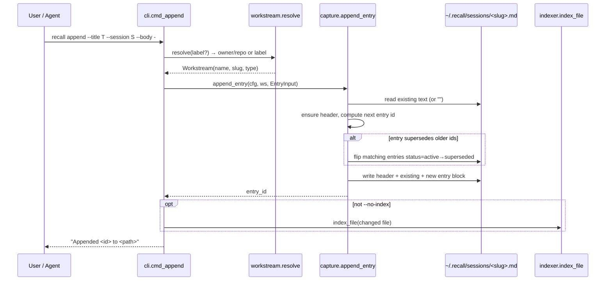
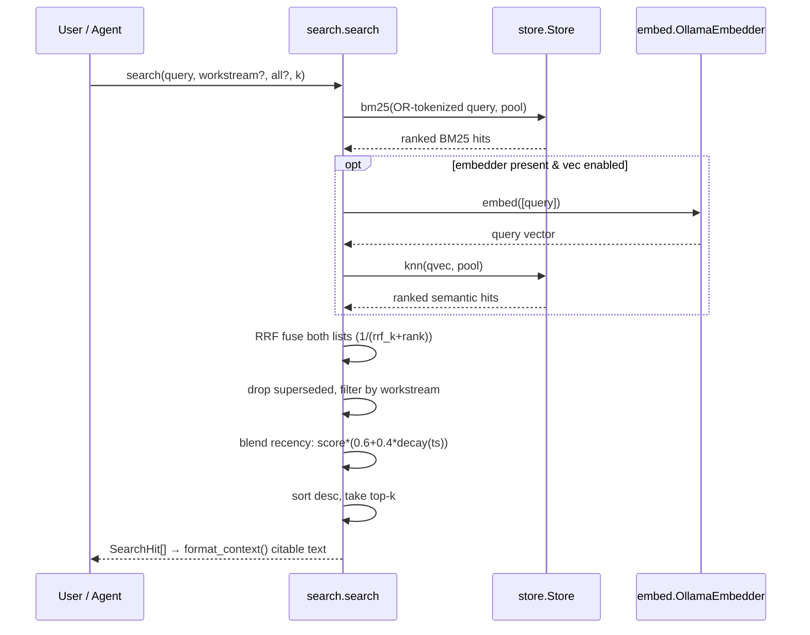
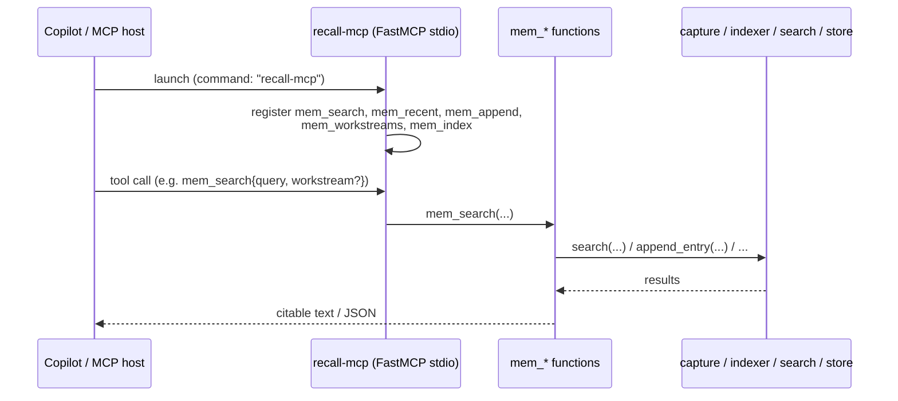
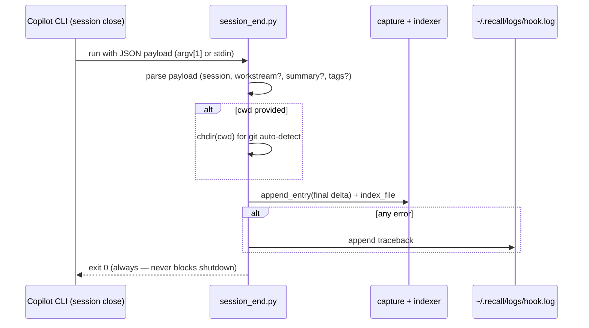

# Call flows

End-to-end sequence diagrams for each operation. File references point at
`src/recall/*` unless noted.

## 1. Capture — `recall append` (and `mem_append`)



Key points: entry ids are `"{session}-{n}"` (sequential per session); the writer
is append-only; supersession edits old entries' status in place but never deletes.

## 2. Index — `recall index`

```mermaid
sequenceDiagram
    participant CLI as cli.cmd_index
    participant ST as store.Store
    participant IDX as indexer.index_all
    participant PAR as parser.chunks_from_file
    participant EMB as embed.OllamaEmbedder
    participant DB as recall.db

    CLI->>ST: open Store (loads sqlite-vec if available)
    CLI->>IDX: index_all(changed_only)
    loop each sessions/*.md (skip _*, *.summary.md)
        IDX->>DB: stored_hash(slug)
        IDX->>IDX: new_hash = sha256(file)
        alt changed_only and hash unchanged
            IDX-->>IDX: skip
        else
            IDX->>PAR: chunks_from_file(path)
            alt sqlite-vec enabled
                IDX->>EMB: embed([chunk.text ...])
                EMB-->>IDX: vectors (or exception → None)
            end
            IDX->>DB: upsert_workstream(slug, chunks, vectors, hash)
        end
    end
    IDX-->>CLI: {slug: n_chunks}
```

If embedding raises (Ollama down), `_embed_chunks` catches it and returns `None`,
so the chunk is still indexed for BM25 — indexing never fails on a model outage.

## 3. Search — `recall search` (and `mem_search`)



## 4. Consolidate — `recall consolidate`

```mermaid
sequenceDiagram
    participant CLI as cli.cmd_consolidate
    participant CON as consolidate.consolidate
    participant PAR as parser.chunks_from_file
    participant FS as ~/.recall/sessions/

    CLI->>CON: consolidate(cfg)
    loop each workstream *.md (skip _*, *.summary.md)
        CON->>PAR: chunks_from_file(path)
        CON->>CON: keep status==active chunks
        CON->>FS: write <slug>.summary.md (durable, Tier-1)
    end
    CON->>FS: write _index.md (catalog of all workstreams)
    CON-->>CLI: {slug: n_active}
```

## 5. MCP server — `recall-mcp`



The `mem_*` functions are plain Python (unit-tested without an MCP runtime);
`main()` only wires them into a FastMCP stdio server.

## 6. Session-end hook — `integrations/hooks/session_end.py`



The hook is deliberately **fail-safe**: bad payloads, missing workstream, or any
exception are logged and swallowed; it always exits `0` so it can never wedge a
session from closing.
