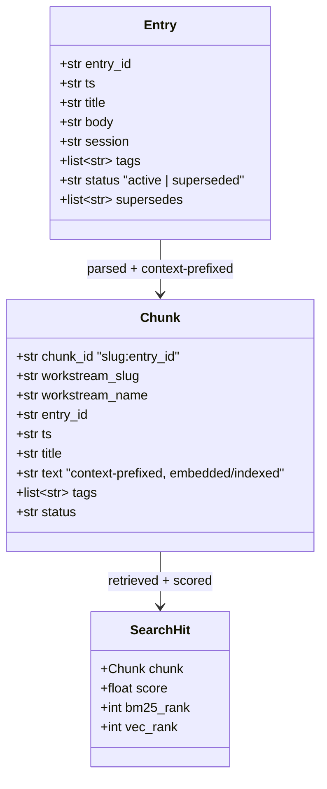
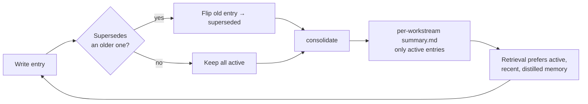

# Design

This document explains *why* Recall is built the way it is — the decisions, the
forces behind them, and the trade-offs accepted.

## 1. Goals & non-goals

**Goals**
- **Local-first & private.** No cloud, no API keys, no telemetry. Your memory
  never leaves your machine.
- **Durable & trustworthy.** Memory is human-readable Markdown you own, not a
  black-box vector blob.
- **Self-evolving.** The KB gets *better*, not just bigger: decisions can
  supersede older ones, and consolidation distills durable summaries.
- **Universal.** Works for any "workstream" — code repos *and* non-code work
  (research, writing, ops).
- **Resilient.** Degrades gracefully; an offline machine still gets keyword search.

**Non-goals**
- Not a team/shared knowledge base (it's *personal* memory; sync is your choice).
- Not an LLM-summarization service by default (consolidation is deterministic/
  extractive so it runs fully offline; an LLM can be layered on later).
- Not a general document store — it's optimized for short, structured decision
  entries, not arbitrary PDFs.

## 2. Locked design decisions

| Decision | Choice | Why |
|----------|--------|-----|
| Runtime | **Python ≥ 3.10** | Ubiquitous, great SQLite/stdlib story, easy for agents to run. |
| Source of truth | **Markdown** | Readable, diffable, greppable, editable by hand; survives the tool. |
| Index | **SQLite + FTS5 + sqlite-vec** | One file, zero services, transactional; BM25 and vectors in the same store. |
| KB location | **global `~/.recall/`** | Memory spans repos and machines; not tied to one checkout. |
| Workstream id | **git `owner/repo`, else `--workstream`** | Auto-correct scope with zero config in repos; explicit for non-code. |
| Embeddings | **Ollama `embeddinggemma`** | Local, free, good quality; model is configurable. |
| Fusion | **Reciprocal Rank Fusion + recency decay** | Rank-based fusion is robust to incomparable BM25/cosine scales. |
| Failure mode | **graceful degradation** | A memory tool that crashes when offline is worse than useless. |

## 3. Data model



- An **Entry** is the atomic, append-only unit a user/agent writes.
- A **Chunk** is one entry plus its workstream context, prefixed so retrieval is
  self-describing (e.g. `Workstream: acme/api-gateway\nEntry: auth-refactor (ts)`).
  Today the mapping is 1 entry → 1 chunk; the `Chunk` abstraction leaves room to
  split large entries later without touching the index/search layers.
- A **SearchHit** carries the fused score plus the per-strategy ranks for
  explainability/debugging.

## 4. Retrieval: how a result is scored

Recall runs two independent retrievers and fuses them:

1. **BM25 (FTS5).** The query is tokenized into words and OR-ed
   (`"jwt OR auth OR revocation"`) so it's forgiving of phrasing. Returns a ranked
   list.
2. **Semantic (sqlite-vec).** The query is embedded once via Ollama and matched by
   cosine distance against chunk vectors. Returns a ranked list.

**Reciprocal Rank Fusion** combines them without needing comparable scores:

```
score(d) = Σ_retrievers  1 / (rrf_k + rank_retriever(d))
```

Then a **recency weight** (exponential decay with a configurable half-life) is
blended in, and `superseded` chunks are dropped (unless explicitly included):

```
final(d) = rrf(d) * (0.6 + 0.4 * recency_weight(d.ts))
```

Why this shape:
- **RRF** is robust when one retriever is missing (BM25-only still ranks sensibly)
  and avoids score-normalization headaches between BM25 and cosine.
- The **0.6 + 0.4·recency** blend keeps relevance dominant while letting newer
  decisions edge out stale ones — important because memory should prefer your
  *latest* thinking.

## 5. The evolving loop (why it's "self-evolving")



The KB improves over time because:
- **Supersession** lets a new decision retire an old one *without deleting history*
  — the superseded entry stays in Markdown for provenance but is filtered out of
  default retrieval.
- **Consolidation** distills the current *active* set into an always-injectable
  durable summary (Tier-1 memory) plus a catalog, so the signal-to-noise ratio
  stays high as the raw log grows.

## 6. Incremental indexing

Re-embedding everything on every change is wasteful. `store.files(slug, hash)`
stores a SHA-256 of each workstream file; `recall index` re-chunks/re-embeds only
files whose hash changed. `recall index --full` ignores hashes for a full rebuild
(e.g. after changing the embedding model or `dim`).

## 7. Trade-offs accepted

- **Extractive consolidation** (no LLM) keeps everything offline and deterministic,
  at the cost of less fluent summaries. An LLM-abstractive mode is a clean future
  add (it only needs to replace the body of `consolidate.py`).
- **Whole-file reindex on change.** Simpler and correct; fine for human-scale
  append rates. Entry-level diffing is a future optimization.
- **One global KB.** Maximizes cross-project recall ("have we solved this before?")
  but means workstream scoping is a filter, not a hard boundary.
- **OR-ed BM25 terms** favor recall over precision; RRF + semantic + recency
  re-tighten the top of the list.

## 8. Security & privacy

- Nothing is sent anywhere except your **local** Ollama instance for embeddings.
- Don't store secrets/credentials in entries; the copilot-instructions template
  explicitly tells agents not to.
- The KB is yours: encrypt the folder, put it in a private git remote, or keep it
  purely local.
