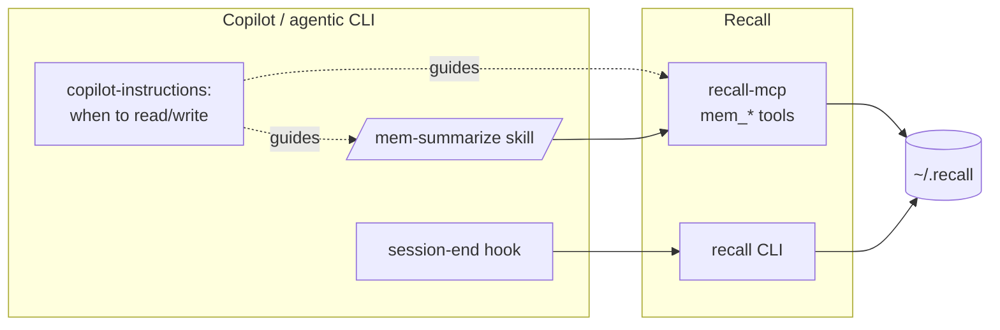

# MCP & Copilot integration

Recall plugs into Copilot (or any MCP-capable agent) through three pieces: an
**MCP server** (read/write tools), a **skill** (`/mem-summarize`), and a
**session-end hook** (automatic final capture). A copilot-instructions snippet
tells the agent *when* to use them.



## 1. Register the MCP server

Add to your MCP config (e.g. `~/.copilot/mcp-config.json`):
```json
{
  "mcpServers": {
    "recall": {
      "command": "recall-mcp"
    }
  }
}
```
`recall-mcp` is installed as a console script by `pip install ".[mcp]"`. It speaks
MCP over stdio via FastMCP.

### Tools exposed
| Tool | Signature | Use |
|------|-----------|-----|
| `mem_search` | `(query, workstream?, all_workstreams=false, k=6) → text` | Retrieve relevant prior decisions as citable context. |
| `mem_recent` | `(workstream?, n=10) → list` | "Where did we leave off?" orientation. |
| `mem_append` | `(title, body, workstream?, session="", tags?, supersedes?) → {entry_id, workstream}` | Write a structured entry and reindex. |
| `mem_workstreams` | `() → list` | List known workstreams + counts. |
| `mem_index` | `(changed_only=true) → {slug: n}` | (Re)build the index. |

The tool *logic* is plain Python in `src/recall/mcp_server.py` (unit-tested
without an MCP runtime), so you can call/test it directly too.

## 2. Add the copilot-instructions snippet

Paste [`integrations/copilot-instructions.snippet.md`](../integrations/copilot-instructions.snippet.md)
into your repo's `.github/copilot-instructions.md` (or your global Copilot
instructions). It tells the agent:

- **When to READ** (`mem_search`): at task start, before non-trivial decisions, on
  "have we done this before?" (`all_workstreams=true`), and `mem_recent` for
  orientation — always citing returned `chunk_id`s.
- **When to WRITE**: run `/mem-summarize` at milestones; the session-end hook
  captures the final delta automatically; use `mem_append` (set `supersedes` when
  replacing an older decision).
- **Hygiene**: keep entries self-contained, never store secrets.

## 3. Install the `/mem-summarize` skill

Install [`integrations/skills/mem-summarize/`](../integrations/skills/mem-summarize/SKILL.md) so the agent can
distill the session delta into a single structured entry on demand or at
milestones. The skill prefers `mem_append`, with a `recall append` CLI fallback.

It captures only the **delta** since the last summary, using sections:
```
### Decision  ### Why  ### Tradeoffs  ### Gotchas  ### Open  ### Refs
```

## 4. Wire the session-end hook

Wire [`integrations/hooks/session_end.py`](../integrations/hooks/session_end.py) as a Copilot session-end /
stop hook. On session close it appends a final delta and reindexes. It is
**fail-safe**: it logs to `~/.recall/logs/hook.log` and always exits `0`, so it can
never block shutdown.

Payload (all fields optional; passed as `argv[1]` JSON or on stdin):
```json
{
  "session": "97f80d49",
  "workstream": "acme/api-gateway",
  "cwd": "/path/to/repo",
  "title": "auth-refactor",
  "summary": "### Decision ...\n### Why ...",
  "tags": ["auth", "jwt"],
  "supersedes": ["97f80d49-1"]
}
```
If `workstream` is omitted it auto-detects from `cwd`'s git repo. If `summary` is
omitted, a minimal placeholder records that the session occurred.

## 5. Works with any agentic CLI

Nothing here is Copilot-specific:
- Any MCP host can launch `recall-mcp` and call the `mem_*` tools.
- Any agent can shell out to the `recall` CLI.
- See [`AGENTS.md`](../AGENTS.md) for a tool-agnostic agent guide.
